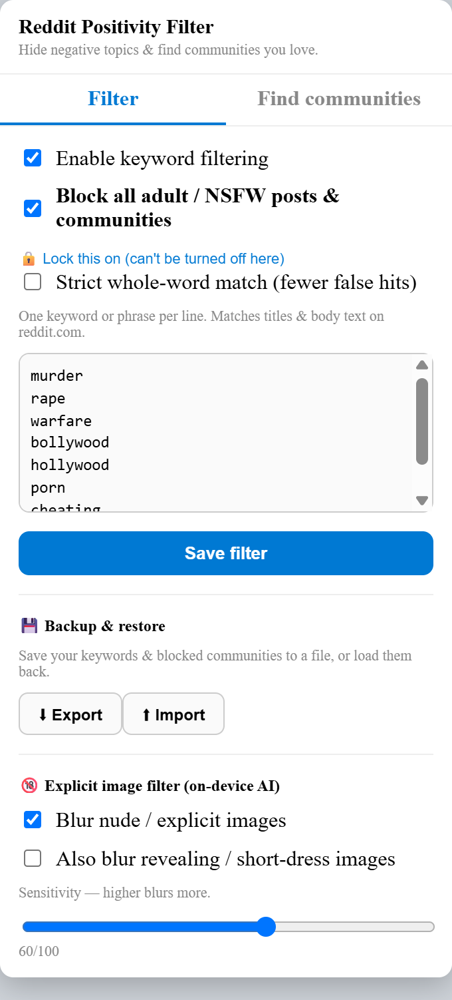
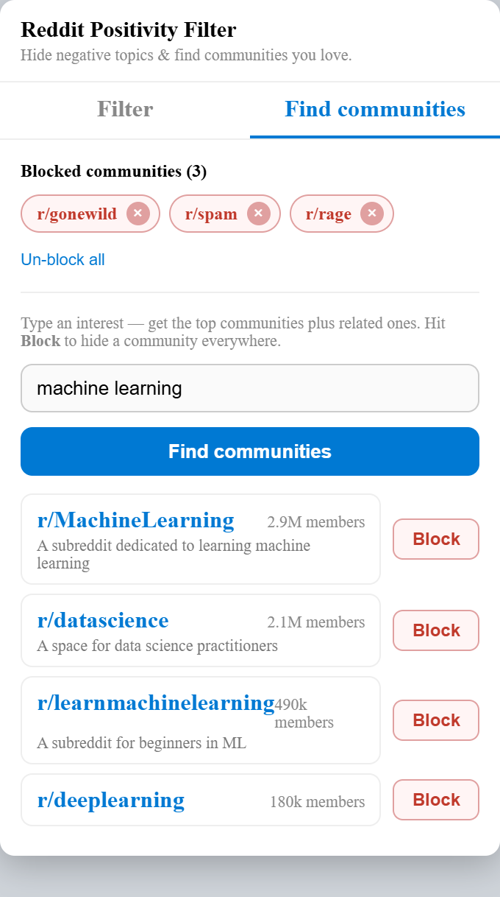

# 🛡️ Reddit Positivity Filter

[](https://github.com/Rishabh-creator601/Reddit-filters/releases)
[](https://github.com/Rishabh-creator601/Reddit-filters/releases/latest)


A privacy-first Chrome / Edge extension that keeps **negative, vulgar and adult content off your Reddit** — and helps you discover the communities you actually care about.

Everything runs **locally in your browser**. No servers, no tracking, no data ever leaves your machine.

---

## 📸 Screenshots

<table>
<tr>
<td align="center"><b>Filter &amp; settings</b></td>
<td align="center"><b>Find &amp; block communities</b></td>
</tr>
<tr>
<td></td>
<td></td>
</tr>
</table>

---

## ⬇️ Download

**[⬇️ Download reddit-positivity-filter.zip](https://github.com/Rishabh-creator601/Reddit-filters/releases/latest/download/reddit-positivity-filter.zip)** — then follow the install steps below.

*(Downloads are counted via GitHub Releases — see the downloads badge above.)*

---

## ✨ Features

| Feature | What it does |
|---|---|
| 🚫 **Adult / NSFW blocking** | Hides every post Reddit flags `over_18`, and shows a full-page block on any 18+ community so you can't view or join it. Can be **locked** so it can't be switched off. |
| 🧹 **Keyword filter** | Hides posts/comments mentioning topics you choose — ships with violence, abuse, cheating, profanity, film industry (Bollywood/Hollywood) and warfare. Fully editable. |
| 🖼️ **Explicit-image AI** | An on-device TensorFlow.js model (NSFWJS) blurs nude/explicit images. Optional "revealing" mode + sensitivity slider. No image leaves your browser. |
| 🔎 **Community finder** | Type an interest (e.g. *machine learning*) and get the top ~20 relevant communities, including related ones, ranked by relevance + popularity. |
| ⛔ **Block any community** | A floating **Block** button on every subreddit, plus **Block** buttons in the finder. Blocked communities are hidden everywhere and their pages are blocked. |
| 💾 **Backup & restore** | Export your keywords and blocked communities to a file and import them on another computer. |

---

## 🔧 Install (Developer Mode — ~30 seconds)

1. **[Download the ZIP](https://github.com/Rishabh-creator601/Reddit-filters/releases/latest/download/reddit-positivity-filter.zip)** and unzip it (or `git clone` this repo).
2. Open **Chrome** → `chrome://extensions` (Edge → `edge://extensions`).
3. Turn on **Developer mode** (top-right).
4. Click **Load unpacked** and select the unzipped folder.
5. Open **reddit.com** — filtering starts immediately. Click the toolbar icon for settings.

> Updating the code later? Click the **↻ reload** icon on the extension card and refresh your Reddit tab.

---

## 📖 How to use

Click the extension's toolbar icon to open the popup. It has two tabs.

### Filter tab
- **Enable keyword filtering** — master switch for the word list.
- **Block all adult / NSFW** — hides Reddit-flagged adult posts and blocks 18+ community pages (on by default).
  - **🔒 Lock this on** — makes adult blocking permanent (can't be toggled off in the popup). *Note: uninstalling the extension is the only way to remove it — no browser extension can be truly un-undoable.*
- **Strict whole-word match** — reduces false hits (e.g. stops "war" matching "warm").
- **Keyword box** — one word/phrase per line; click **Save filter**.
- **💾 Backup & restore** — **Export** your setup to a file, or **Import** it back.
- **🔞 Explicit image filter** — toggle image blurring, optionally include "revealing" images, and set sensitivity. The ~7 MB AI model loads once on first use.

Hidden items appear as a small "🚫 Hidden" bar. Keyword matches offer **Show anyway**; adult/blocked content is hard-hidden with no reveal.

### Find communities tab
- **Blocked communities** — a live list of everything you've blocked, each with an un-block **×**.
- **Search box** — type an interest and press **Find communities**.
- Each result has a **Block** button — blocks that community everywhere.

### On Reddit itself
- Visit any community and a floating **🚫 Block r/…** button appears in the bottom-right. One click blocks it: the page is blocked, its posts vanish from your feeds, and it won't be recommended.

---

## 🔒 Privacy

- **No external servers.** Filtering and image classification run entirely in your browser.
- The community finder talks **only to Reddit's own API**, using your existing session.
- No analytics, no telemetry, no accounts.

---

## 🗂️ Project structure

```
manifest.json      Extension config (Manifest V3)
content.js         Filtering, NSFW/community blocking, block button, finder
content.css        Styles for hidden posts, block page, block button
popup.html/js      Toolbar UI (filters, image AI, finder, blocked list, backup)
vendor/            TensorFlow.js + NSFWJS (bundled, run locally)
model/             NSFWJS MobileNetV2 weights (bundled)
```

---

## ⚙️ Tech

- Manifest V3 · vanilla JS (no build step)
- [TensorFlow.js](https://www.tensorflow.org/js) + [NSFWJS](https://github.com/infinitered/nsfwjs) for on-device image classification
- Reddit's public JSON API for NSFW flags and community search
